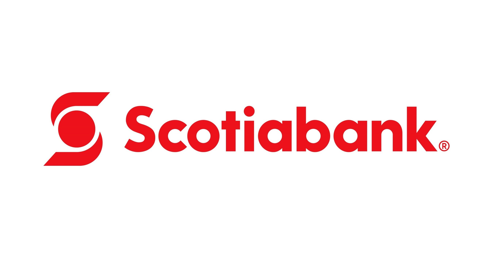

# fintech-case-study1: Scotiabank

## Domain: Payment/Billing
### Scotiabank in the Fintech Domain of payments and billing
- Establish on March 30, 1832
- Became the first chartered bank in Nova Scotia and held their first shareholders' meeting at the Merchants Exchange Coffee House on May 10, 1832.

- Competitors:RBC, DT, etc...